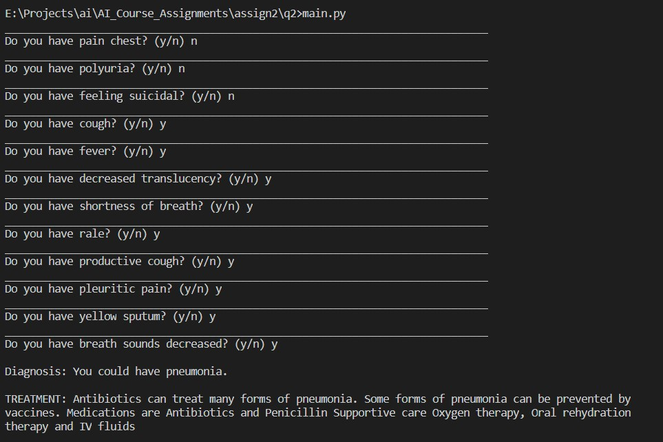
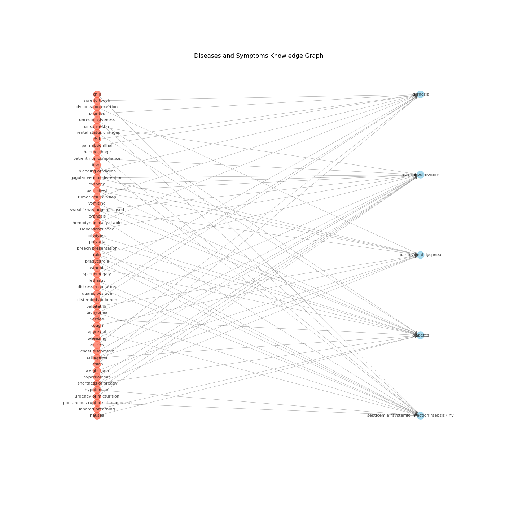
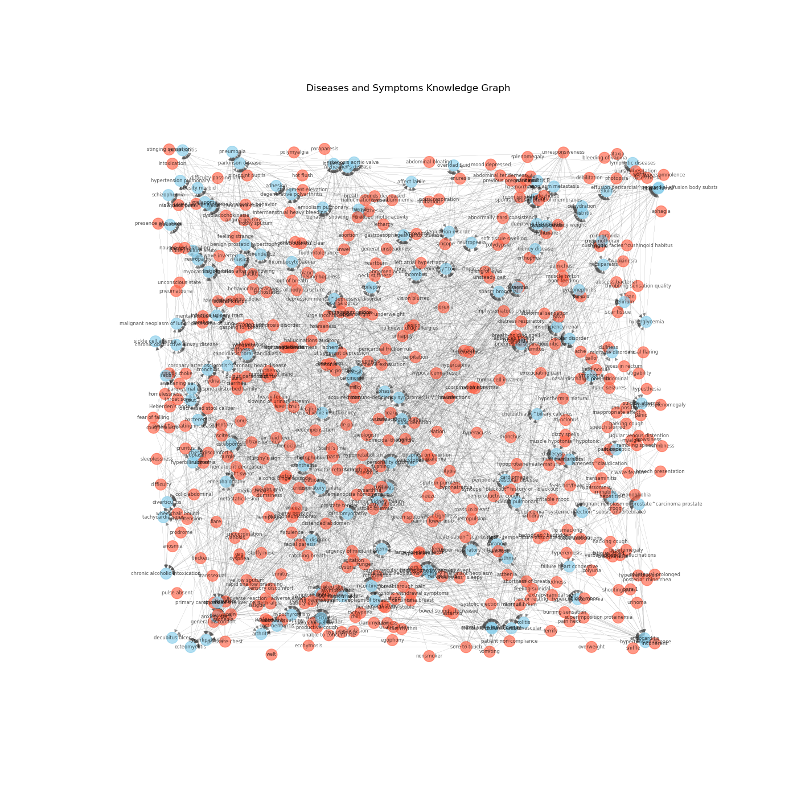

### Medical Expert Diagnostic System
- The python library <bold>pyke</bold> has been used as the expert system shell for this assignment.
 
- run it using

    - <code>python main.py</code>

- Example of a diagnosis.

### KnowledgeBase Construction
- The dataset (dataset.csv) has been scraped from the internet and preprocessed.
It contains diseases in the first row, number of cases of that disease in 2nd row and
symptoms in the third row.

- Treatments for the diseases have been found separately by using google knowledge graph api. The file cleaned_dataset.csv contains cleaned data along with the treatments for corresponding diseases.

- The final dataset contains a total of 127 diseases, symptoms and their treatments.

- This data has been used to construct .krb files (used by pyke) which contains rules for all diseases and conditions. The script create_rule_file does this job.

- This rule base is used by pyke's inference engine, to know all the details
required (like asking if the user has a symptom) to do diagnosis and reports the disease or condition, the user is most likey to have.

- It also outputs the treatment to be taken for the disease/condition.

### Disease-Symptom graph
- The file kg.py contains python script that uses the data collected to form
a knowledge graph using the python module networkx. 
- Graphs for less number of diseases (5 and 10) has been plotted to easily show the knowledge graph.
- Knowledge graph for the whole set has also been plotted. 

